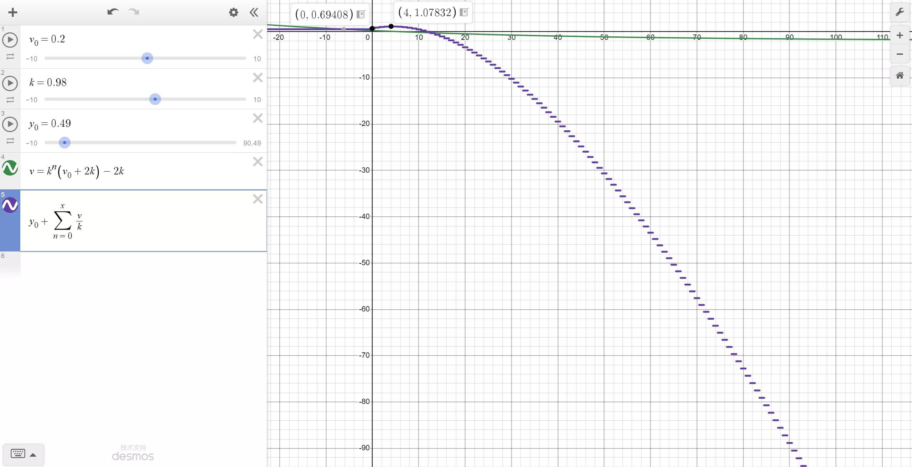

> TNT 的坐标指向其包围盒中心

实现在

```cpp
virtual void PrimedTnt::normalTick()
```

函数中。

满足 重力 - 位移 - 阻力 模式。

令 $v$ 是 TNT 实体的速度，则：

$$
\vec{v}_{new} = k(v - \vec{g}),
$$

其中 $k=0.98, \vec{g}=(0, -0.04, 0)$ 。
如果仅考虑垂直方向，则 $v$ 与时间 $t$ (gt) 的关系可简单表示为：

$$
v(t) = k^{t} (v_{0} + 2k) - 2k
$$

同时有 $y-t$ 关系

$$
y(t) = y_{0}+\sum_{n=0}^{t}\frac{v}{k}
$$


